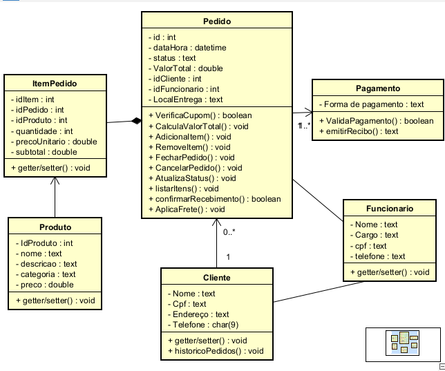

# Descrição do Projeto

Este sistema foi criado para modelar um sistema de delivery de comida em um restaurante. Com o objetivo de ser simples, foram criadas 6 classes que interagem entre si.

## Relacionamentos

- **Cliente e Pedido**: Um cliente pode ter 0 ou vários pedidos, sendo que cada pedido pertence a um único cliente.
- **Pedido, Item Pedido e Produtos**: Pedidos se comunicam com Item Pedido e Produtos, relação necessária para gerenciar os itens solicitados.
- **Entrega**: Quando o status do pedido for "Pronto", será encaminhado para o Funcionário que realizará a entrega ou diretamente para o Cliente, caso opte pela retirada no local.
- **Herança**: Um funcionário pode ser cliente também, utilizando herança da classe Cliente.

